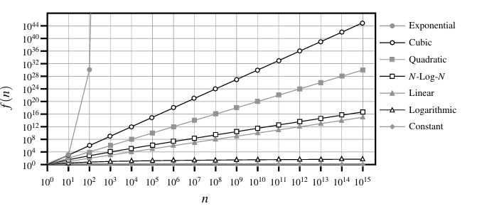

# Data Structures and Algorithms
## Experimental Studies in Python

There are multiple ways to measure runtime in Python. One simple method is to measure an *epoch* using the `time()` function from the Python `time` module.  
This function measures *wall-clock* time, meaning that the elapsed time may depend on other processes running on the CPU.

Another metric is the number of CPU cycles used by an algorithm. For this, we can use the `clock()` function from the `time` module.

### Challenges of Experimental Analysis
1. Experiments must be performed on the same hardware and software environment.
2. Only a limited set of test inputs is typically available.
3. The algorithm must be fully implemented before being analyzed.

---

## Asymptotic Analysis

First, we define a set of **primitive operations**:
1. **Assigning** an identifier to an object  
2. **Retrieving** the object associated with an identifier  
3. **Performing** arithmetic operations  
4. **Comparing** two numbers  
5. **Accessing** a single list element by index  
6. **Calling** a function (excluding operations performed inside it)  
7. **Returning** from a function  

---

## Important Functions for Analysis

### 1. Constant Function
$$
f(n) = c
$$
where $ c $ is a constant.

### 2. Logarithmic Function
$$
x = \log_b n \iff b^x = n
$$

Logarithms can be computed using calculus or using approximations (e.g., $ \lceil \log_2 12 \rceil = 4 $).

Logarithm rules:
1. $ \log_b(ac) = \log_b a + \log_b c $
2. $ \log_b(a/c) = \log_b a - \log_b c $
3. $ \log_b(a^c) = c \log_b a $
4. $ \log_b a = \frac{\log_d a}{\log_d b} $
5. $ b \log_d a = a \log_d b $

### 3. Linear Function
$$
f(n) = n
$$

### 4. N-Log-N Function
$$
f(n) = n \log n
$$

### 5. Quadratic Function
$$
f(n) = n^2
$$

Quadratic behavior appears in algorithms with nested loops, where:
1. The inner loop performs a linear number of operations and the outer loop iterates linearly: $ n \cdot n = n^2 $
2. The inner loop performs incrementally more work each iteration:  
$$
1 + 2 + 3 + \dots + n = \frac{n(n+1)}{2}
$$

### 6. Cubic and Higher-Degree Polynomials
$$
f(n) = a_0 + a_1 n + a_2 n^2 + a_3 n^3 + \dots + a_d n^d
$$

where  
- $ a_i $ are coefficients  
- $ d $ is the degree of the polynomial  
- $ a_d \neq 0 $

Examples:
- $ f(n) = 1 $  
- $ f(n) = n $  
- $ f(n) = n^2 $  
- $ f(n) = 2 + 5n + n^2 $

### 7. Exponential Function
$$
f(n) = b^n
$$
where  
- $ b $ is the base  
- $ n $ is the exponent  

#### Geometric Sums
$$ \sum_{i=0}^n a^i = 1 + a + a^2 + \dots + a^n = \frac{a^{n+1} -1}{a - 1} $$
---




## The "Big-Oh" Notation

Let $f,g : \mathbb{Z}_{>0} \to \mathbb{R}_{>0}$ be functions.

$$ f(n) = O(g(n)) \implies \exists c >0 \;\; \exists n_0 \geq 1: f(n) \leq cg(n), \; \forall n\geq n_0 $$


#### Example: 
The function $8n + 5 \in  O(n)$ 
#### Justification:
$ 8n \leq cn, \quad \forall n \geq n_0 $, lets choose $c=9$ and $n_0=5$.


## Properties of the Big-Oh Notation
> The big-Oh notation allows us to ignore constant factors (e.g. 5) and lower-order terms (e.g. $n$ if $O(n^2)$) and docus on the main components of a function that affect its growth.


#### Example:
$$ 5n^4 + 3n^3 + 2n^2 + 4n + 1 \in O(n^4) $$
#### Justification:
$$ 5n^4 + 3n^3 + 2n^2 + 4n + 1 \in O(n^4) \leq (5+3+2+4+1)n^4 = cn^4, $$
for $c = 15$, when $n\geq n_0=1$.

#### Example:
$$ 20n^3 + 10n\log n + 5 \in O(n^3) $$
#### Justification:
$$ 20n^3 + 10n\log n + 5 \leq 35n^3 ,$$
for $n \geq 1$.


## Big-Omega
Similar to Big-Oh, however:
$$ f(n) \geq cg(n) $$

## Big-Theta
Two functions grow at the same rate, up to constannt factors.
$$ f(n) \in O(g(n)), \;\; f(n) \in \Omega(g(n)) \implies c'g(n) \leq f(n) \leq c''g(n) $$

## Examples of Algorithm Analysis

### Analysis of Maxumum-Finding Algorithm
```py
biggest = A[0]
for each element A[j]:
    if A[j] > biggest:
        # update: O(log n)
        biggest = A[j]          
```

$$ P(\text{the j-th element is the largest of the first j})  = \frac{1}{j} $$
Hence the expected number of times we update the biggest number is 
$$ H_n = \sum_{j=1}^n \frac{1}{j} $$
The Harmonic number $H_n$ is $O(\log n)$.

### A Quadratic-Time Algorithm

```py
def prefix_average(S):
    n = len(S)
    A = [0]*n

    for j in range(n):
        # O(n)
        total = 0
        for i in range(j+1):
            # O(j+1)
            # 1 + 2 + 3 + ... + n = n(n+1)/2 = O(n^2)
            total += S[i]

        A[j] = total/(j+1)

    return A
    # O(n) + O(n^2) = O(n^2)


def prefix_average_2(S):
    n = len(S)
    A = [0]*n

    for j in range(n):
        # O(j+1)
        A[j] = sum(S[0:j+1]) / (j+1)

    return A
    # O(n^2)
```

### A Linear-Time Algorithm

```py
 def prefix_average3(S):
    # O(1)
    n=len(S)
    # O(n)
    A = [0]*n
    # O(1)
    total = 0
    # O(n) 
    for j in range(n):
        # the sum is computed dynamically
        # O(n) in total
        total += S[j] 
        # O(n) in total
        A[j] = total/(j+1) 
    
    return A
```

### Three-Way Set Disjointntess

```py
def disjoint1(A, B, C):
    # O(n^3)
    for a in A:
        for b in B:
            for c in C:
                if a == b == c:
                    return False
    return True
```

```py
def disjoint2(A, B, C):
    for a in A:
        # O(n)
        for b in B:
            # O(n^2)
            if a == b:
                for c in C:
                    # runs only if a == b: O(n^3)
                    # worst case: if all a == b
                    # O(n^2) if nums are unique
                    if a == c:
                        return False
    return True
```


### Element Uniqueness

```py
def unique1(S):
    for j in range(len(S)):
        # O(n)
        for k in range(j+1, len(S)):
            # (n-1) + (n-2) + ... + 1 = O(n^2)
            if S[j] == S[k]:
                return False

    return True
```

#### Using sorting as a Problem-Solving Tool

```py
def unique2(S):
    temp = sorted(S)
    for j in range(1, len(temp)):
        # O(n)
        if S[j-1] == S[j]:
            return False

    return True
```

## Simple Justification Techniques


### By Example
* Example
> $\exists x \in S: P(x)$
> We need to find a particular $x$
* Counter Example
> $\forall x \in S: P(x)$
> We need to find a particular $\neg P(x)$
### The "Contra" Attack
* Contrapositive
> if `ab` *even* -> `a` is *even* **OR** `b` is *even*
> if `a` is *odd* **AND** `b` is *odd* -> `ab` is *odd*

* Contradiction
We establish statement q as true by first supposing that q is false and showing that this assumption leads to a contradiction (such as $2 \neq 2 \text{ or } 1 > 3$)

By reaching such a contradiction, we show that no consistent sitaution exists with q being **false**, so q must be **true**.

#### Example
> Let a and b be integers.     
$odd(ab) \Rightarrow odd(a) \land  odd(b)$;

Let ab be odd. Lets assume the opposite, namely, 
$$ even(a) \lor even(b) $$
$$ a = 2j: ab = (2j)b = 2(jb) $$
$$ 2(jb): even(ab) $$

This is a contradiction. Therefore, a is odd and b is odd

### Induction and Loop Invariants

#### Example
Condider the Fib function F(n), which is defined such that
$F(1) = 1$, $F(2) = 2$, $F(n) = F(n-2) + F(n-1)$, for $n>2$.

#### Base cases: 
$n\neq2: F(1) = 1 < 2 = 2^1 $ and $F(2) = 2 < 4 = 2^2$
#### Induction step:
Using inductive hypothesis: $n>2: F(n) < 2^{n-2} + 2^{n-1}$, since
$$ 2^{n-2} + 2^{n-1} < 2^{n-1} + 2^{n-1} = 2 * 2^{n-1} = 2^n $$


### Loop Invariants
To prove some statement $\mathcal{L}$ about a loop is correct, define $\mathcal{L}$ in terms of a series of smaller statements $\mathcal{L}_0, \mathcal{L}_1, \dots, \mathcal{L}_k $ where:
1. The initial claim, $\mathcal{L}_0$ is true before loop begins.
2. if $\mathcal{L}_{j-1}$ is true before iteration j, then $\mathcal{L}_j$ will be true after iteration j.
3. The final statement, $\mathcal{L}_k$, implies the desired statement $\mathcal{L}$ to be true.

```py
def find(S, val):
    n = len(S)
    j = 0
    while j < n:
        if S[j] == val:
            return j
        j += 1
    return -1
```
$\mathcal{L}_j$: val is not equal to any of the first elements of S.
